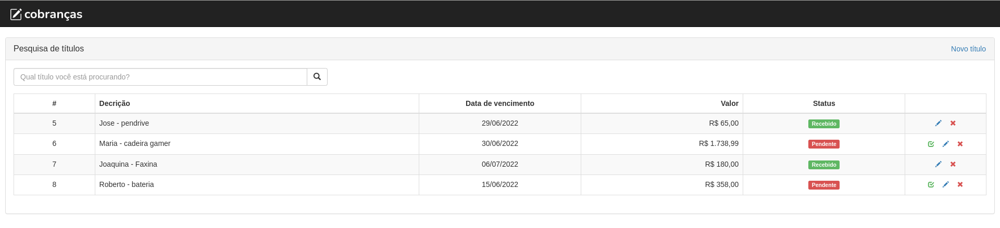

# COBRANÇA

Aplicativo desenvolvido em SpringBoot para controle de contas à receber. Utiliza o banco de dados DB2 na IBM Cloud para persistência de dados



## Requisitos

- [Java 8](https://www.oracle.com/br/java/technologies/javase/javase-jdk8-downloads.html)
- [Apache Maven](https://maven.apache.org/download.cgi#/)
- [Eclipse IDE for Enterprise Java](https://www.eclipse.org/downloads/packages/)

## Dependencias

* **Conta na IBM Cloud** para o serviço do Db2: [Crie uma conta gratuita na IBM Cloud](https://cloud.ibm.com/registration).


Crie o serviço do **Db2** clicando [aqui](https://cloud.ibm.com/catalog/services/db2)

#### Obtenha as credenciais do banco

* No menu principal (☰), selecione **Resource list** para encontrar o serviço **Db2** sob **Services and software**.
* Clique em **Db2** 
* Vá até **Service credentiais**, expanda a credencial e capture o valor das chaves **username**, **password** e **jdbc_url**
* Na chave **jdbc_url** substitua os valores de \<username> e \<password> pelas chaves **username** e **password** respectivamente

# Instalação

Navegue até a pasta src -> resources e faça uma cópia do arquivo `application.properties.example`
renomeando-o para `application.properties`

Abra o arquivo `application.properties` e preencha os dados com as credenciais do seu banco

```
spring.datasource.url=preencha-com-a-chave:jdbc_url

```
 > Se quiser, pode usar o banco H2 (descomentar no pom.xml) e comentar a dependência para o Db2. Porém, por ser um banco que fica apenas em memória, os dados não serão persistidos

Instale o Java e o Eclipse

Importe o projeto para o Eclipse: File → Import → Existing Maven Projects


